English | [简体中文](README.zh-CN.md)

# app-lifelog

A local-first personal life database: capture with #tags, search, filter, and export to Excel.

Everything lives in one stream of notes — diary entries, films, novels, TV shows, todos, travel
notes and plans. There are no per-domain modules: each note is a single record, and the `#tags`
inside its text classify it automatically.

## Table of Contents

- [Background](#background)
- [Features](#features)
- [Install](#install)
- [Usage](#usage)
- [Architecture](#architecture)
- [Data and storage](#data-and-storage)
- [Development](#development)
- [Tech stack](#tech-stack)
- [Project conventions](#project-conventions)
- [License](#license)

## Background

A personal database for everyday notes should be instant to write into and easy to search — not a
filing system you have to maintain. Most open-source note servers either trade startup speed for a
web stack (Electron, server + browser client) or split "capture" and "retrieval" into features you
have to switch between.

This project takes the opposite approach:

- **Capture is a search bar.** A global hotkey opens a slim, always-on-top input window; type,
  press `Ctrl+Enter`, and it is stored. No window switching, no category to pick first.
- **Organisation is derived, never declared.** No folders, no note types, no diary/film/todo
  modules — one stream plus `#tags` parsed out of the text.
- **Retrieval is filtering.** Full-text search (SQLite FTS5 with the `trigram` tokenizer, so Chinese
  text and mid-word matches work), tag filters with counts, and ordering.
- **Everything stays local.** One SQLite file under your user profile. No account, no sync service,
  no network calls.
- **Excel is the escape hatch.** The whole database exports to a single `.xlsx`, so the data
  outlives the application.

Built on Tauri 2, so the executable is around 12 MB and the installer around 3 MB, with no bundled
browser engine (it uses the system WebView2).

## Features

**Quick capture window**

- Toggled by the global hotkey `Ctrl+Shift+Q` (falls back to the tray menu if the hotkey is taken)
- Search-bar styling: starts as a single slim rounded line and grows automatically up to five lines
- Sticker mode: stays on top and does not hide when it loses focus, so it can be left open while
  you work; `Esc` or the collapse button hides it
- Mouse-wheel zoom from 50% to 200%, no modifier key required
- Remembers position, size, zoom level and pin state across restarts
- Shows a "saved at HH:MM" confirmation and clears itself, ready for the next entry

**Main window**

- A single column: composer, filter bar, note stream
- Filtering by keyword, by tag (click a `#tag` chip or a tag in a note), and ordering
  newest-first or oldest-first, paged 50 notes at a time
- Inline editing in a VSCode-style split pane: Markdown source on the left, live preview on the
  right, `Ctrl+Enter` to save
- Deleting asks for confirmation

**Notes**

- `#tags` are extracted from the text and stripped from the body, then stored in a tag table with
  link rows, so a tag rename or an edit updates the associations
- Markdown rendering (tables, task lists, fenced code with syntax highlighting) through a single
  sanitising entry point
- `#todo` notes render a checkbox; ticking it swaps the tag to `#done`, unticking swaps it back
- Timestamps shown to the minute, with a machine-readable `datetime` attribute

**Export**

- "Export all" writes the entire database to one `.xlsx` sheet (time, body, tags, created time)

## Install

### Prebuilt (Windows 11 x64)

Download the installer (`*-setup.exe`) from the
[releases page](https://github.com/Zzz210s/app-lifelog/releases) and run it; it bootstraps WebView2
if that is missing. The release also carries the standalone `app-lifelog.exe`, which needs no
installation.

### From source

Requirements: Node.js, pnpm, a Rust toolchain and the MSVC build tools on Windows.

```bash
pnpm install
pnpm tauri build
```

Artifacts:

- `src-tauri/target/release/app-lifelog.exe` — standalone executable
- `src-tauri/target/release/bundle/nsis/app-lifelog_0.1.0_x64-setup.exe` — installer

## Usage

1. Launch the app. The main window opens; the tray icon appears next to the clock.
2. Press `Ctrl+Shift+Q` anywhere to open the quick capture window.
3. Type a note. Include `#tags` to classify it, for example:

   ```
   看了奥本海默,9 分 #电影
   买牛奶 #todo
   2026-09-11 阴,下午写完了迁移脚本 #日记
   ```

4. Press `Ctrl+Enter` (or click Save). The note is stored and the main window refreshes.
5. In the main window, search by keyword, click a tag chip to filter, switch the ordering, edit a
   note in the split pane, tick `#todo` items, or export everything to Excel.

Tray menu: open the main window, open quick capture, quit. A second launch of the app does not
start another instance — it surfaces the quick capture window of the running one.

Autostart is supported through the Tauri autostart plugin; when started by the system the app
passes `--minimized` and goes straight to the tray instead of showing the main window.

## Architecture

The application is a single Tauri process hosting two webview windows and a Rust command layer.
All state lives in SQLite; the frontend never talks to the database directly.



- **Frontend (`src/`)** — TypeScript + React, two Vite entry points: `index.html` (main window) and
  `quick.html` (quick capture).
  - `src/main-window/` — stream UI: `App.tsx` orchestrates; `use-notes-feed.ts` owns the query state
    machine (paging, request sequencing, error sources); `use-note-created.ts` subscribes to the
    backend event that refreshes the list after a quick capture; `NoteStream`/`NoteItem`/`EditPanel`
    render, filter and edit notes.
  - `src/quick-window/` — `QuickCapture.tsx` plus window controls.
  - `src/shared/` — `api.ts` (typed command wrappers), `markdown.ts` (Markdown-it pipeline and
    DOMPurify policy), `links.ts` (external links open in the system browser), `zoom.ts`,
    `note-source.ts` (shared pre-save normalisation), `time.ts`.
- **Command layer (`src-tauri/src/commands/`)** — thin Tauri commands for notes, settings, window
  control and export.
- **Domain layer (`src-tauri/src/`)** — `tags.rs` (tag tokeniser), `db/repos/` (notes CRUD, search
  queries, tag counts, settings), `exchange/` (Excel export), `windowing/` (tray, global hotkey,
  quick-window geometry and zoom).
- **Data layer (`src-tauri/src/db/`)** — a shared `Mutex<Connection>` behind Tauri state, opened
  with WAL journaling, foreign keys on and a busy timeout; versioned SQL migrations in
  `db/migrations/`.

Notes are written in one transaction that also rebuilds the note's tag links; SQLite triggers keep
the FTS index in sync on insert, update and delete.

## Data and storage

- Database: `%APPDATA%\app.lifelog\lifelog.db` (SQLite, WAL). Delete this file to start over.
- Search index: an FTS5 virtual table inside the same file, kept in sync by triggers.
- Excel export: written wherever you point the save dialog; nothing is uploaded.

## Development

```bash
pnpm install            # dependencies
pnpm tauri dev          # run with hot reload
pnpm tauri build        # release build (LTO enabled)

pnpm typecheck          # tsc --noEmit
pnpm test               # vitest
cd src-tauri && cargo test
```

Verification status at the time of writing: 63 frontend tests, 58 Rust tests, typecheck and build
clean, `cargo check` with no warnings.

Debugging the webviews over CDP: set
`WEBVIEW2_ADDITIONAL_BROWSER_ARGUMENTS=--remote-debugging-port=9222` before `pnpm tauri dev`, then
inspect `http://127.0.0.1:9222/json/list`. `scripts/dev-cdp.mjs` is a small helper for that.

## Tech stack

| Layer | Choice |
| --- | --- |
| Shell | Tauri 2 (tray icon, global shortcut, autostart, single instance, dialog, opener plugins) |
| Backend | Rust, `rusqlite` with bundled SQLite, `rust_xlsxwriter` |
| Frontend | React 19, TypeScript, Vite, Tailwind CSS 4 |
| Markdown | `markdown-it` + `markdown-it-task-lists`, DOMPurify, `highlight.js` |
| Tests | Vitest (jsdom) for the frontend, `cargo test` for Rust |
| Storage | SQLite with FTS5 (`trigram` tokenizer) |

## Project conventions

These are enforced in the codebase rather than being suggestions:

- No source file longer than 200 lines; extract a module instead of growing one
- All UI copy in Chinese
- No emoji anywhere in the source, the UI or commit messages
- Every byte of rendered Markdown passes through one sanitising component
- Failures are surfaced to the user, never swallowed silently
- `docs/superpowers/` and `.superpowers/` (design and task workspaces) are deliberately gitignored

## License

[MIT](LICENSE)
